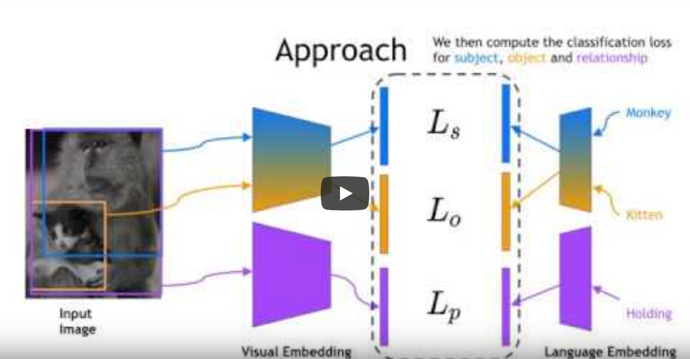
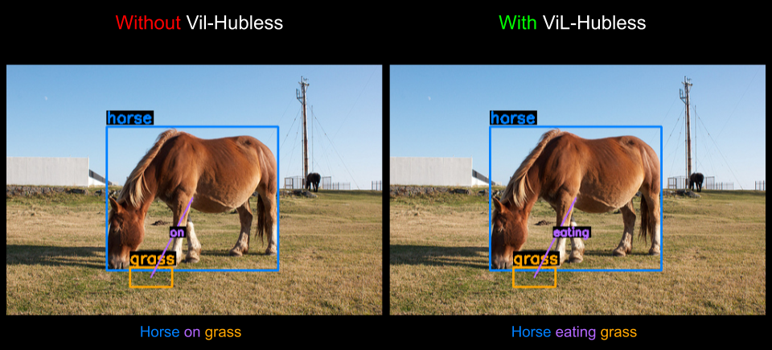
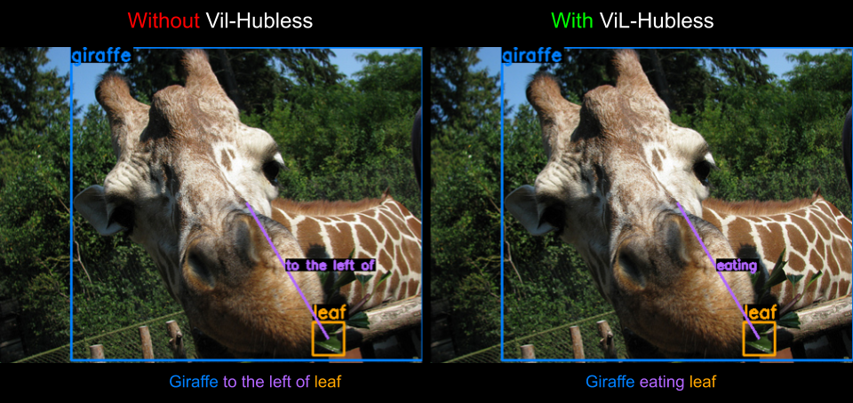

# Long-tail Visual Relationship Recognition with a Visiolinguistic Hubless Loss (LTVRR)
Watch our video below:

[](https://youtu.be/ceEuCXr8Ow8)




<p align="center">Example results from the GQA dataset.</p>

This is a PyTorch implementation for [Long-tail Visual Relationship Recognition with a Visiolinguistic Hubless Loss](https://arxiv.org/abs/2004.00436).

This code is for the GQA and VG8K datasets.

We borrowed the framework from [Detectron.pytorch](https://github.com/roytseng-tw/Detectron.pytorch) and [Large-scale Visual Relationship Understanding](https://github.com/jz462/Large-Scale-VRD.pytorch) for this project, so there are a lot overlaps between these two and ours.

## Benchmarking on GQA
| Method                         |  Backbone         | many     | medium   | few       | all       |
| :---                           |       :----:      |  :----:  |  :----:  |  :----:   |  :----:   |
| Baseline \[1\]                 |  VGG16            | **70.5** | 36.2     | 3.5       | 51.9      |
| Baseline \[1\] + ViLHub        |  VGG16            | 69.8     | **42.1** | **9.5**   | **53.9**  |
| Focal Loss \[2\]               |  VGG16            | 69.6     | 38.0     | 4.7       | 52.1      |
| Focal Loss \[2\] + ViLHub      |  VGG16            | **69.8**	| **41.7** | **8.1**   | **53.7**  |
| WCE \[2\]                      |  VGG16            | **39.3**	| 36.5     | 16.2      | **35.5**  |
| WCE + ViLHub \[2\]             |  VGG16            | 35.2	    | **39.5** | **18.8**  | 34.2      |


\[1\] [Zhang et al. "Large-scale visual relationship understanding." Proceedings of the AAAI Conference on Artificial Intelligence. 2019.](https://wvvw.aaai.org/ojs/index.php/AAAI/article/view/4953)

\[2\] [Lin et al. "Focal loss for dense object detection." Proceedings of the IEEE international conference on computer vision. 2017.](http://openaccess.thecvf.com/content_ICCV_2017/papers/Lin_Focal_Loss_for_ICCV_2017_paper.pdf)

## Requirements
* Python 3
* Python packages
  * pytorch 0.4.0 or 0.4.1.post2 (not guaranteed to work on newer versions)
  * torchvision 0.1.8
  * cython
  * matplotlib
  * numpy
  * scipy
  * opencv
  * pyyaml
  * packaging
  * [pycocotools](https://github.com/cocodataset/cocoapi)
  * tensorboardX
  * tqdm
  * pillow
  * scikit-image
  * gensim
* An NVIDIA GPU and CUDA 8.0 or higher. Some operations only have gpu implementation.

To make things easier we provided the environment file `environment.yml` created by running the command `conda env export -f environment.yml`.
To clone the environmentt you can simply run `conda env create -f environment.yml` from the project root directory.


## Compilation
Compile the CUDA code in the Detectron submodule and in the repo:
```
cd $ROOT/lib
sh make.sh
```

## Annotations

Create a data folder at the top-level directory of the repository:
```
# ROOT=path/to/cloned/repository
cd $ROOT
mkdir data
```

### GQA
Download it [here](https://drive.google.com/file/d/1sPCXQWN_YOE-4eNaCM3zn7UN_S_QZEVe/view?usp=sharing). Unzip it under the data folder. You should see a `gvqa` folder unzipped there. It contains seed folder called `seed0` that contains .json annotations that suit the dataloader used in this repo.

### Visual Genome
Download it [here](https://drive.google.com/file/d/1PIJPSphmRZlNnmaVdC0zn3eWy4GEb7VY/view?usp=sharing). Unzip it under the data folder. You should see a `vg8k` folder unzipped there. It contains seed folder called `seed3` that contains .json annotations that suit the dataloader used in this repo.


### Word2Vec Vocabulary
Create a folder named `word2vec_model` under `data`. Download the Google word2vec vocabulary from [here](https://code.google.com/archive/p/word2vec/). Unzip it under the `word2vec_model` folder and you should see `GoogleNews-vectors-negative300.bin` there.

## Images

### GQA
Create a folder for all images:
```
# ROOT=path/to/cloned/repository
cd $ROOT/data/gvqa
mkdir images
```
Download GQA images from the [here](https://cs.stanford.edu/people/dorarad/gqa/download.html)

### Visual Genome
Create a folder for all images:
```
# ROOT=path/to/cloned/repository
cd $ROOT/data/vg8k
mkdir VG_100K
```
Download Visual Genome images from the [official page](https://visualgenome.org/api/v0/api_home.html). Unzip all images (part 1 and part 2) into `VG_100K/`. There should be a total of 108249 files.

## Pre-trained Object Detection Models
Download pre-trained object detection models [here](https://drive.google.com/open?id=16JVQkkKGfiGt7AUt789pUPX3o84Cl2hL). Unzip it under the root directory and you should see a `detection_models` folder there.

## Our Trained Relationship Detection Models
Download our trained models [here](https://drive.google.com/open?id=12zvgkUjgxAGEE99o0l6rcCCeE4QP4cYZ). Unzip it under the root folder and you should see a `trained_models` folder there.

## Directory Structure
The final directories for data and detection models should look like:
```
|-- data
|   |-- vg
|   |   |-- VG_100K    <-- (contains Visual Genome images)
|   |   |-- seed3    <-- (contains annotations)
|   |   |   |-- rel_annotations_train.json
|   |   |   |-- rel_annotations_val.json
|   |   |   |-- ...
|   |-- gvqa
|   |   |-- images    <-- (contains GQA training images)
|   |   |-- seed0    <-- (contains annotations)
|   |       |-- annotations_train.json
|   |       |-- annotations_val.json
|   |       |-- ...
|   |-- word2vec_model
|   |   |-- GoogleNews-vectors-negative300.bin
|-- trained_models
|   |-- e2e_relcnn_VGG16_8_epochs_gvqa_y_loss_only
|   |   |-- gvqa
|   |       |-- Mar02-02-16-02_gpu214-10_step_with_prd_cls_v3
|   |           |-- ckpt
|   |               |-- best.pth
|   |-- ...
```
## Evaluating Pre-trained Relationship Detection models

DO NOT CHANGE anything in the provided config files(configs/xx/xxxx.yaml) even if you want to test with less or more than 8 GPUs. Use the environment variable `CUDA_VISIBLE_DEVICES` to control how many and which GPUs to use. Remove the
`--multi-gpu-test` for single-gpu inference.

### GQA
**NOTE:** May require at least 64GB RAM to evaluate on the GQA test set

We use three evaluation metrics:
1. Per-class accuracy (sbj, obj, rel)
1. Overall accuracy (sbj, obj, rel)
1. Overall triplet accuracy
1. Accuracy over frequency bands (many, medium, few, and all) using exact matching
1. Accuracy over frequency bands (many, medium, few, and all) using synset matching
1. Average word similarity between GT and detection for \[word2vec_gn, word2vec_vg, lch, wup, lin, path, res, jcn] similarities

```
python tools/test_net_rel.py --dataset gvqa --cfg configs/gvqa/e2e_relcnn_VGG16_8_epochs_gvqa_y_loss_only_hubness.yaml --do_val --load_ckpt Outputs/e2e_relcnn_VGG16_8_epochs_gvqa_y_loss_only_hubness/gvqa/Mar11-07-01-07_gpu210-18_step_with_prd_cls_v3/ckpt/best.pth  --use_gt_boxes --use_gt_labels --seed 0
```

### Visual Genome
**NOTE:** May require at least 64GB RAM to evaluate on the Visual Genome test set

We use three evaluation metrics:
1. Per-class accuracy (sbj, obj, rel)
1. Overall accuracy (sbj, obj, rel)
1. Overall triplet accuracy
1. Accuracy over frequency bands (many, medium, few, and all) using exact matching

```
python tools/test_net_rel.py --dataset vg8k --cfg configs/vg8k/e2e_relcnn_VGG16_8_epochs_vg8k_y_loss_only_hubness.yaml --do_val --load_ckpt Outputs/e2e_relcnn_VGG16_8_epochs_gvqa_y_loss_only_hubness/vg8k/Mar11-07-01-07_gpu210-18_step_with_prd_cls_v3/ckpt/best.pth  --use_gt_boxes --use_gt_labels --seed 0
```

## Training Relationship Detection Models

The section provides the command-line arguments to train our relationship detection models given the pre-trained object detection models described above.

DO NOT CHANGE variable `NUM_GPUS` in the provided config files(configs/xx/xxxx.yaml) even if you want to train with less or more than 8 GPUs. Use the environment variable `CUDA_VISIBLE_DEVICES` to control how many and which GPUs to use.

With the following command lines, the training results (models and logs) should be in `$ROOT/Outputs/xxx/` where `xxx` is the .yaml file name used in the command without the ".yaml" extension. If you want to test with your trained models, simply run the test commands described above by setting `--load_ckpt` as the path of your trained models.


### GQA
To train our relationship network using a VGG16 backbone with the ViL-Hubless loss, run
```
python tools/train_net_step_rel.py --dataset gvqa --cfg configs/gvqa/e2e_relcnn_VGG16_8_epochs_gvqa_y_loss_only_hubness100k.yaml --nw 8 --use_tfboard --seed 0
```

To train our relationship network using a VGG16 backbone without the ViL-Hubless loss, run
```
python tools/train_net_step_rel.py --dataset gvqa --cfg configs/gvqa/e2e_relcnn_VGG16_8_epochs_gvqa_y_loss_only_baseline.yaml --nw 8 --use_tfboard --seed 0
```

To train our relationship network using a VGG16 backbone with the RelMix augmentation, run
```
python tools/train_net_step_rel.py --dataset gvqa --cfg configs/gvqa/e2e_relcnn_VGG16_8_epochs_gvqa_y_loss_only_baseline_relmix.yaml --nw 8 --use_tfboard --seed 0
```

To run models with different ViL-Hubless scales create a new config file under `configs/gvqa/` (by copying the file `configs/gvqa/e2e_relcnn_VGG16_8_epochs_gvqa_y_loss_only_hubness.yaml`) and change the variable `TRAIN.HUBNESS_SCALE` to the desired value.
Also confirm the ViL-Hubless loss is activated by making sure the variable `TRAIN.HUBNESS` is set to `True`

### Visual Genome
To train our relationship network using a VGG16 backbone with the ViL-Hubless loss, run
```
python tools/train_net_step_rel.py --dataset vg8k --cfg configs/vg8k/e2e_relcnn_VGG16_8_epochs_vg8k_y_loss_only_hubness100k.yaml --nw 8 --use_tfboard --seed 3
```

To train our relationship network using a VGG16 backbone without the ViL-Hubless loss, run
```
python tools/train_net_step_rel.py --dataset vg8k --cfg configs/vg8k/e2e_relcnn_VGG16_8_epochs_vg8k_y_loss_only_baseline.yaml --nw 8 --use_tfboard --seed 3
```

To train our relationship network using a VGG16 backbone with the RelMix augmentation, run
```
python tools/train_net_step_rel.py --dataset vg8k --cfg configs/vg8k/e2e_relcnn_VGG16_8_epochs_vg8k_y_loss_only_baseline_relmix.yaml --nw 8 --use_tfboard --seed 3
```

To run models with different ViL-Hubless scales create a new config file under `configs/vg8k/` (by copying the file `configs/vg8k/e2e_relcnn_VGG16_8_epochs_vg8k_y_loss_only_hubness.yaml`) and change the variable `TRAIN.HUBNESS_SCALE` to the desired value.
Also confirm the ViL-Hubless loss is activated by making sure the variable `TRAIN.HUBNESS` is set to `True`


## Acknowledgements
This repository uses code based on the [Large-scale Visual Relationship Understanding](https://github.com/jz462/Large-Scale-VRD.pytorch) source code by Zhang Ji, 
as well as code from the [Detectron.pytorch](https://github.com/roytseng-tw/Detectron.pytorch) repository by Roy Tseng.

## Citing
If you use this code in your research, please use the following BibTeX entry.
```
@misc{abdelkarim2020longtail,
    title={Long-tail Visual Relationship Recognition with a Visiolinguistic Hubless Loss},
    author={Sherif Abdelkarim and Panos Achlioptas and Jiaji Huang and Boyang Li and Kenneth Church and Mohamed Elhoseiny},
    year={2020},
    eprint={2004.00436},
    archivePrefix={arXiv},
    primaryClass={cs.CV}
}
```
